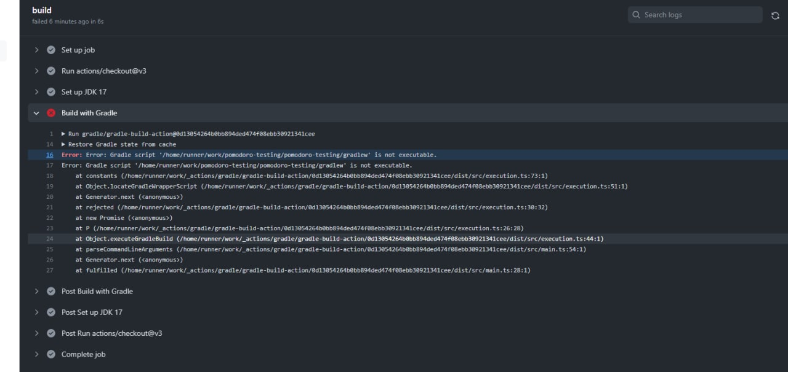

# Pomodoro

**Пока остановился на *56* минуте на видеоуроке**

Если не идет сборка на гите, то требуется сделать следующую команду, чтобы сборка полностью завершилась:

- `git update-index --chmod=+x gradlew`
- `git commit -a -m "Make gradlew executable v2"`
- `git push`
